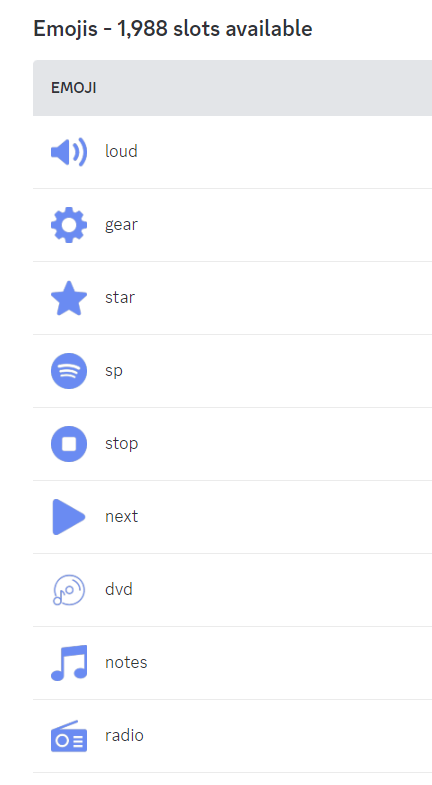
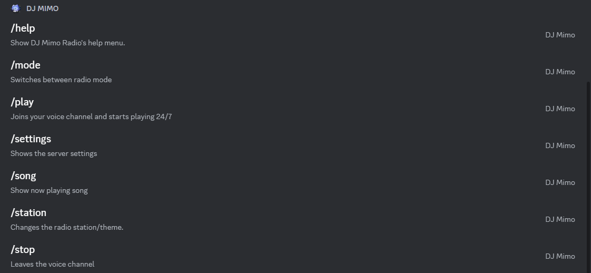
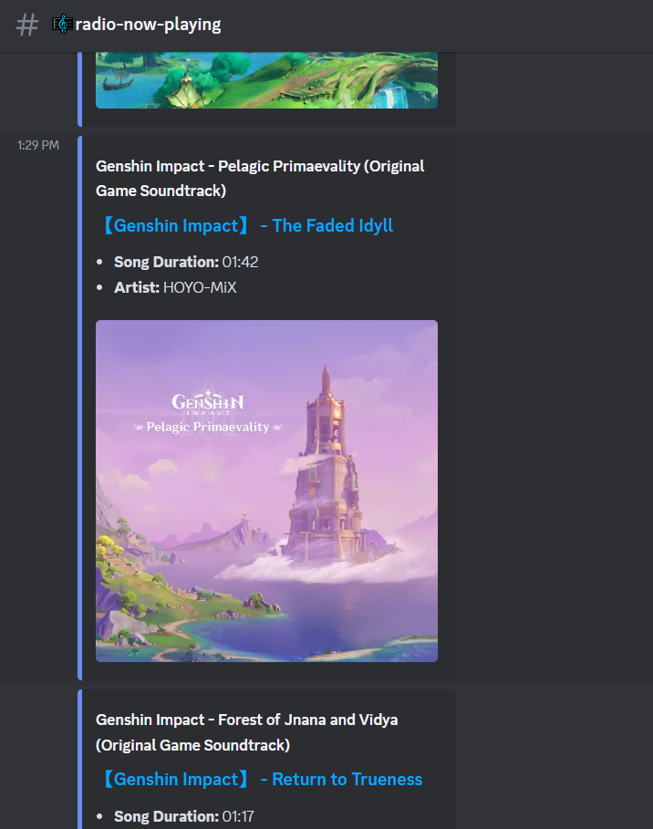

<!-- PROJECT LOGO -->
<br />
<p align="center">
  <a href="https://github.com/zuna107/DJ-Mimo">
    
  </a>

  <h3 align="center">DJ Mimo Radio</h3>

  <p align="center">
    It is a discord music bot which can play HoYoMiX song 24/7 &  more functions of DJ Mimo radio bot
    <br />
    <br />
    <a href="https://github.com/zuna107/DJ-Mimo-MusicBot/issues">Report Bug</a>
    ·
    <a href="https://github.com/zuna107/DJ-Mimo-MusicBot/issues">Request Feature</a>
  </p>
</p>
<!-- ABOUT THE PROJECT -->


###
If you liked this repository, feel free to leave a star ⭐ to help promote !

## 🎶 Functions
-  Radio Mode
-  24/7 VC 
-  Dj Roles (Admin/author)
-  Slash Command
-  Radio Stations

## 📻 Instal


For install all dependencies use
```
npm install
```
To start your bot 
```
node src/index.js 
```
or
```
nodemon
```

## 🖼️ Screenshots
<br />
<p align="center">
    
    
    
</p>

<br>
_____

# Note
Hi, this is zetsuna as a Bot Assistant and Moderator on the HoYoLAB Discord Server: [Lab ID Corner].
If you experience problems and issues please contact me on Discord:
- [Discord zetsuna](https://discordapp.com/users/948093919835590666)

<br>

# 💌 Support Server 
- [Join Server](https://discord.gg/MwV9tm6RPX)
- [HoYoLAB](https://www.hoyolab.com/accountCenter/postList?id=107593323)


